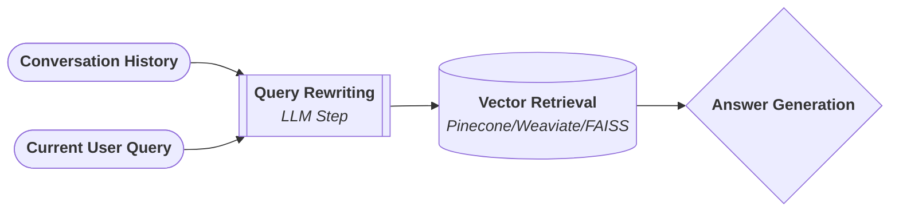
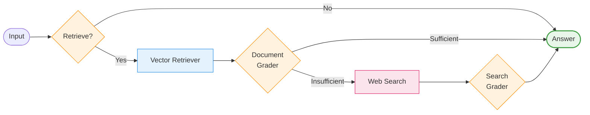

# Simple History-Aware RAG System  
**Chains-first RAG → Graph-based CRAG Extension**

This repository implements **two complementary Retrieval-Augmented Generation (RAG) pipelines**:

1. **History-aware RAG using LangChain chains only**
2. **Graph-based RAG (`graph_rag`) implementing a CRAG-style control flow**

The project is designed for **learning, experimentation, and deep understanding**
of how conversational RAG systems work **internally**, without relying on opaque agent abstractions.

---

## 📌 What This Repo Covers

| Component | Purpose |
|--------|--------|
| `rag_llm.py` | History-aware RAG using chains only |
| `graph_rag.ipynb` | Graph-based RAG with retrieval, grading, and web fallback |
| `store_doc.py` | Document ingestion & vector store creation |
| `requirements.txt` | Minimal, explicit dependencies |

---

## 🎯 Project Objectives

### Primary Goals
- Understand **when retrieval is actually necessary**
- Learn how **conversation history affects search quality**
- Implement **retrieval grading and fallback strategies**
- Compare **linear chain RAG vs graph-based RAG**
- Keep **data flow explicit and debuggable**

---

## 🧠 Part 1 — History-Aware RAG (Chain-Based)

### Design Philosophy
This implementation uses **LangChain chains only**:
- No agents
- No LangGraph
- No hidden memory layers

All logic is explicit and traceable.

---

### 🔹 Core Technique: History-Aware Query Rewriting

Conversation history is **not passed directly to the retriever**. Instead, it is used to transform the user's input into a standalone, search-optimized query.

## Mermaid

This avoids:
- semantic dilution
- longer embeddings
- unstable retrieval behavior

---

### 🔹 Vector-Based Retrieval
- FAISS vector store
- OpenAI embeddings (`text-embedding-3-small`)
- Top-k similarity search

---

### 🔹 Structured Output
Final responses are constrained using a schema (`TypedDict`) to:
- enforce output shape
- simplify debugging
- reduce hallucinated formats

---

## 🧠 Part 2 — Graph-Based RAG (`graph_rag`)

The `graph_rag` implementation extends basic RAG into a **control-flow-aware pipeline** inspired by **CRAG (Corrective RAG)**.

Instead of a linear chain, the system uses **explicit branching decisions** to control retrieval, grading, and fallback behavior.

---

### 🗺️ High-Level Workflow

## Mermaid

---

### 🔹 Why a Graph?

A graph-based design allows the system to:
- Skip retrieval when unnecessary
- Reject weak or irrelevant retrieved documents
- Trigger web search **only when local knowledge fails**
- Make each decision **inspectable and testable**

This reflects **real-world RAG systems**, where retrieval is conditional, not mandatory.

---

### 🔹 Key Components in `graph_rag`

| Node | Responsibility |
|----|--------------|
| `check_retrieve` | Decide whether retrieval is needed |
| `retrieve` | Vector-based document retrieval |
| `grade_documents` | LLM-based relevance grading |
| `transform_query` | Query rewriting for web search |
| `web_search` | External knowledge fallback |
| `generate` | Final answer generation |

Each node operates on a shared state, making data flow transparent.

---

### 🔹 Retrieval Grading

Retrieved documents are evaluated by an LLM to decide:
- Are they relevant?
- Are they sufficient to answer the question?

This prevents:
- hallucinations from weak context
- over-trusting vector similarity alone

---

## 🔍 Chain vs Graph: When to Use What?

| Scenario | Chain-Based RAG | Graph-Based RAG |
|--------|----------------|-----------------|
Simple Q&A | ✅ | ❌ |
Conversational clarification | ✅ | ✅ |
Weak / noisy documents | ❌ | ✅ |
Web fallback required | ❌ | ✅ |
Debuggable control flow | ⚠️ | ✅ |
Production-grade RAG | ⚠️ | ✅ |

---

## 🧪 Intended Audience

This repository is ideal for:
- Students learning RAG internals
- Engineers transitioning from basic RAG to production systems
- Anyone who wants to **see every decision in the pipeline**

---

## ⚠️ What This Project Intentionally Avoids

- Black-box agents
- Hidden memory abstractions
- Auto-magical tool calling
- Over-engineered frameworks

The goal is **understanding first, optimization later**.

---

## 📎 Notes

- Vector stores and data files are intentionally excluded from version control
- `.ipynb` files are used for exploration and visualization
- `.py` files represent production-ready logic

---

## 📌 Next Steps (Suggested Experiments)

- Add confidence scoring to retrieval grading
- Introduce multi-hop retrieval
- Compare latency vs accuracy between chain and graph pipelines
- Convert graph logic into LangGraph for production use

---

**If you understand everything in this repo, you understand RAG.**

